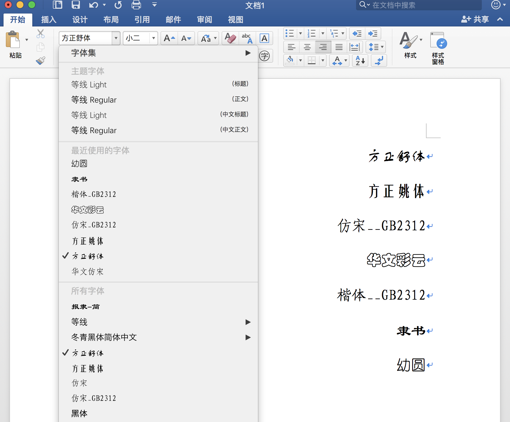

# Chinese-Fonts-4-macOS
    Modified Chinese Fonts compatible to MS Office and Safari for macOS
    修改一些中文字体的名称，以便运行在苹果系统上的微软 OFFICE 和 Safari 可以正确识别及显示这些中文字体。

## TTF 字体名称显示
    微软 Office 2011、2016 for mac，在读取某些老旧的中文字体时，在字体菜单里只能显示其英文名称（如『楷体_GB2312』显示为 "KaiTi_GB2312" 等）。
    这是由于其没有读取正确的、与系统语言相对应的字体名称造成的。
    在使用这个脚本修改中文字体名称之后，可以使 Office 正确识别及显示这些中文字体，如图所示。
  

## 脚本运行需求
    需要安装 fonttools
    `brew install fonttools`

## 脚本运行命令
    脚本的参数是要修改的字体文件路径
    `python chinesefontname.py <target_font>`
    运行成功的话，会在脚本所在目录下生成 `new_` 开头的新的字体；
    可以双击新字体，用『字体册』（Font Book.app）安装该字体，并禁用老的字体，即可。

## 版权声明
    用户在购买正版的 Office 或 Windows 后，可拥有其附带字体的使用权。
    为防止产生字体版权纠纷，这里以学习交流为目的，仅提供可修改字体名称的脚本及相关文件。
    此脚本及相关文件遵循 GPL v3 协议。
    
